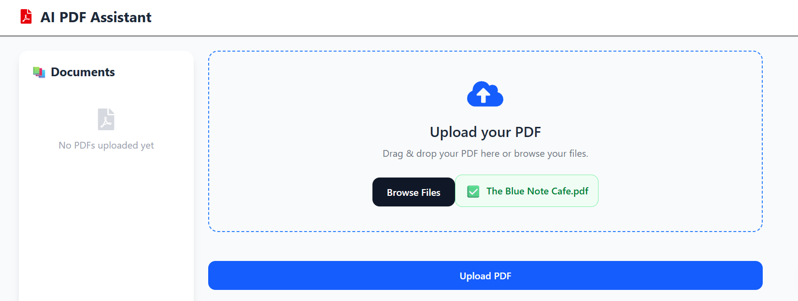
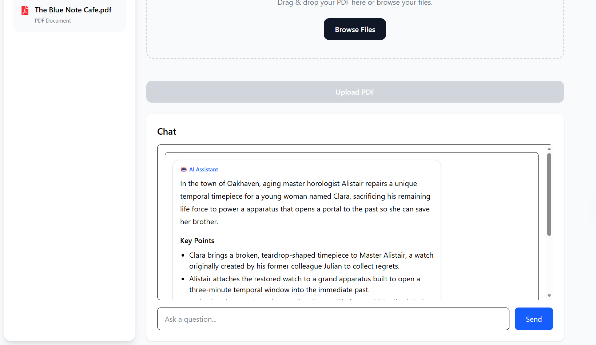

# 📄 AI PDF Assistant

An AI-powered PDF Assistant that allows users to upload PDF documents, automatically generate summaries, and ask questions about the document using Retrieval-Augmented Generation (RAG) with Google Gemini and Qdrant Vector Database.

---

## 🚀 Features

- 📄 Upload PDF documents
- 🧠 Automatic AI-generated document summaries
- 💬 Chat with your PDF using natural language
- 🔍 Semantic search using vector embeddings
- 📚 View all uploaded documents
- 🗑️ Delete documents (removes PDF, metadata, and vector embeddings)
- 📌 Source references with page numbers
- 📝 Markdown-rendered AI responses
- 📤 Drag & Drop PDF upload
- ⚡ FastAPI backend with React frontend

---

## 🛠️ Tech Stack

### Frontend

- React
- Vite
- Tailwind CSS
- Axios
- React Markdown

### Backend

- FastAPI
- Python
- Google Gemini API
- Qdrant Vector Database
- PyMuPDF (PDF text extraction)

### AI & RAG

- Google Gemini
- Vector Embeddings
- Semantic Search
- Retrieval-Augmented Generation (RAG)

---

## 📂 Project Structure

```
AI-PDF-Assistant/
│
├── backend/
│   ├── app/
│   │   ├── ai_service.py
│   │   ├── chunking.py
│   │   ├── config.py
│   │   ├── document_service.py
│   │   ├── embeddings.py
│   │   ├── pdf.py
│   │   ├── routes.py
│   │   ├── storage.py
│   │   ├── vector_store.py
│   │   └── main.py
│   │
│   ├── uploads/
│   └── requirements.txt
│
├── frontend/
│   ├── src/
│   ├── package.json
│   └── vite.config.js
│
└── README.md
```

---

## ⚙️ How It Works

1. User uploads a PDF.
2. Text is extracted from the PDF.
3. The document is split into semantic chunks.
4. Embeddings are generated for each chunk.
5. Embeddings are stored in Qdrant.
6. User asks a question.
7. Relevant chunks are retrieved from Qdrant.
8. Retrieved context is sent to Gemini.
9. Gemini generates an accurate answer based only on the retrieved context.

---

## 🏗️ Architecture

```
                +----------------+
                |    React UI    |
                +--------+-------+
                         |
                         |
                    FastAPI API
                         |
        +----------------+----------------+
        |                                 |
        |                                 |
 PDF Processing                    AI Services
        |                                 |
 Text Extraction                  Google Gemini
        |                                 |
 Chunking                           Answer/Summary
        |                                 |
 Embeddings                             |
        |                                 |
        +-----------+---------------------+
                    |
             Qdrant Vector DB
                    |
          Semantic Search (RAG)
```

---

## 📷 Screenshots

### Upload PDF

_Add screenshot here_

---

### AI Summary

_Add screenshot here_

---

### Chat with PDF

_Add screenshot here_

---

## 📦 Installation

### Clone the repository

```bash
git clone https://github.com/Nbplanet-633/AI-PDF-Assistant.git

cd AI-PDF-Assistant
```

---

## Backend Setup

```bash
cd backend

python -m venv .venv
```

Windows

```bash
.venv\Scripts\activate
```

Install dependencies

```bash
pip install -r requirements.txt
```

Create a `.env` file

```env
GEMINI_API_KEY=YOUR_API_KEY
QDRANT_URL=http://localhost:6333
QDRANT_API_KEY=
```

Run backend

```bash
uvicorn app.main:app --reload
```

---

## Frontend Setup

```bash
cd frontend

npm install

npm run dev
```

---

## Running Qdrant

Using Docker

```bash
docker run -p 6333:6333 qdrant/qdrant
```

---

## API Endpoints

| Method | Endpoint | Description |
|---------|----------|-------------|
| POST | `/upload` | Upload PDF |
| GET | `/documents` | List documents |
| GET | `/documents/{id}` | Get document |
| POST | `/summary/{id}` | Generate summary |
| POST | `/ask/{id}` | Ask questions |
| DELETE | `/documents/{id}` | Delete document |

---

## Future Improvements

- PDF Viewer
- Authentication
- Multi-user support
- Streaming AI responses
- Conversation history
- Cloud storage
- Deploy to production

---

## Learning Outcomes

This project demonstrates:

- Retrieval-Augmented Generation (RAG)
- Vector Databases
- Embedding Generation
- Semantic Search
- Prompt Engineering
- FastAPI Development
- React Development
- REST API Design
- AI Application Architecture

---

## Author

**Neeraj Meena**

- IIT Madras
- Chemical Engineering

---

## Quick LOOk


** summary from the pdf


## License

This project is licensed under the MIT License.